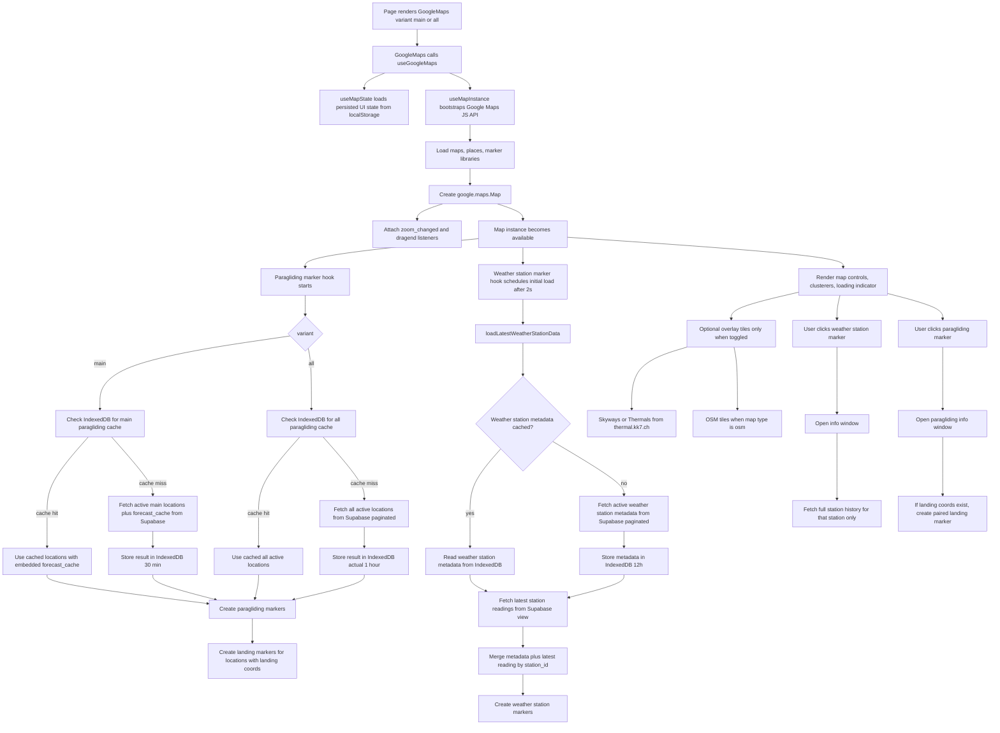
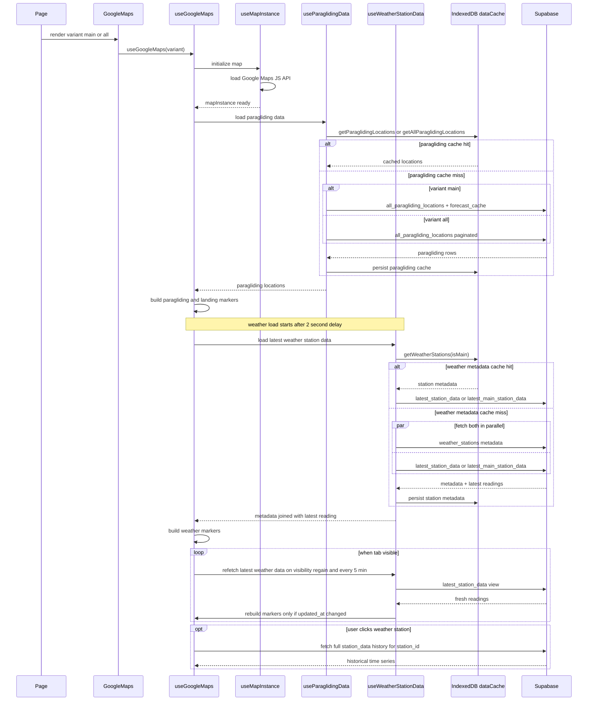

# Google Maps Load Flow

This document describes what happens when the main `GoogleMaps` component loads, what data is fetched, how caching works, and which events trigger refetches.

## Entry Points

- `main` map: `src/app/HomePageClient.tsx`
- `all` map: `src/app/(pages)/locations/all/page.tsx`
- shared component: `src/app/components/GoogleMaps/GoogleMaps.tsx`
- shared orchestration hook: `src/app/components/GoogleMaps/hooks/useGoogleMaps.ts`

## High-Level Flow

## Sequence Diagram

## What Gets Fetched

### 1. Google Maps libraries

`useMapInstance` loads:

- `maps`
- `places`
- `marker`

This happens through `@googlemaps/js-api-loader` before the map is created.

### 2. Persisted map UI state

`useMapState` restores state from localStorage:

- map center
- zoom level
- map type
- marker visibility toggles
- wind filter selection
- promising filter selection
- skyways and thermals overlay toggles
- fullscreen state

This is UI state persistence, not the data cache.

### 3. Paragliding data for `main`

`useParaglidingData` first checks IndexedDB. On a miss it calls:

- `ParaglidingLocationService.getAllMainLocationsWithForecast()`

That fetch includes:

- takeoff location fields
- wind direction metadata (`n`, `e`, `s`, `w`, `ne`, `se`, `sw`, `nw`)
- landing coordinates and altitude
- timezone
- embedded `forecast_cache` rows for the app forecast window

So the `main` map gets location data and forecast data together.

### 4. Paragliding data for `all`

`useParaglidingData` checks IndexedDB. On a miss it calls:

- `ParaglidingLocationService.getAllActiveLocations()`

That fetch includes active locations only, paginated, and does not include `forecast_cache` in the query.

So the `all` map is lighter and does not bring forecast rows with the location list.

### 5. Weather station metadata

`useWeatherStationData` checks IndexedDB for cached station metadata. On a miss it calls:

- `WeatherStationService.getAllActive(isMain)`

That fetch includes fields like:

- station id
- name
- coordinates
- altitude
- provider
- `is_main`
- `country`
- `updated_at`

### 6. Latest weather station readings

Regardless of whether station metadata is cached, the latest readings are fetched from Supabase on every weather-marker load:

- `StationDataService.getLatestStationData(isMain)`

This reads from:

- `latest_main_station_data` for the `main` map
- `latest_station_data` for the `all` map

Fields fetched:

- `station_id`
- `wind_speed`
- `wind_gust`
- `direction`
- `temperature`
- `updated_at`

Then metadata and latest readings are merged client-side by `station_id`.

### 7. Weather station history on click

When a weather station info window opens, `WeatherStationInfoWindow` fetches:

- `StationDataService.getStationDataByStationId(location.station_id)`

This is not prefetched during map load. It is a per-click fetch for historical data.

### 8. Optional tile overlays

These are not part of the core Supabase data load.

- Skyways and Thermals tiles come from `thermal.kk7.ch`
- OSM base tiles come from `tile.openstreetmap.org`

They only load when the relevant overlay or map type is active.

## Caching Model

## Data Cache: IndexedDB

The app uses `src/lib/data-cache.ts` with an IndexedDB database named `WindLordCache`.

Cached entries:

- `windlord_cache_paragliding`
- `windlord_cache_all_paragliding`
- `windlord_cache_main_weather_stations`
- `windlord_cache_all_weather_stations`

### Cache durations

- main paragliding with forecast: 30 minutes
- all paragliding: 1 hour in code
- weather station metadata: 12 hours

Important: the comment for all paragliding says 1 day, but the actual constant is `60 * 60 * 1000`, which is 1 hour.

### What is cached

Cached:

- paragliding location lists
- main-map forecast rows embedded with main paragliding locations
- weather station metadata

Not cached in IndexedDB here:

- latest station readings
- historical station data on info-window open
- Google Maps JS libraries
- external tile overlays

## UI State Cache: localStorage

Map UI state is stored separately in localStorage under `windlord_map_state`.

This includes:

- center and zoom
- active filters and toggles
- selected map type
- fullscreen state

Wind-related filters have a 30-minute TTL. When expired, the app clears:

- selected wind directions
- promising filter

while preserving the rest of the map state.

## Refetch and Refresh Triggers

### Paragliding data

Paragliding data is loaded when the marker hook initializes after the map instance is ready.

Refetch happens when:

- the relevant IndexedDB cache entry is missing
- the cache entry has expired
- another part of the app clears or mutates the cache

There is no periodic background polling for paragliding data in the map hooks.

### Weather station metadata

Metadata is only refetched when:

- the cache is missing
- the cache has expired

Otherwise the cached metadata is reused.

### Latest weather station readings

Latest station readings are much fresher than metadata and are intentionally reloaded.

They are fetched:

- on initial weather-station load
- when the page becomes visible again
- every 5 minutes after aligning to the next 5-minute mark

The interval refresh only runs while the tab is visible.

### Marker rebuild rules for weather stations

Background refresh compares each station's `updated_at` timestamp with the previous set.

If nothing changed:

- marker state is kept
- no marker rebuild happens

If readings changed:

- weather station markers are recreated from the fresh merged dataset

If a background refresh fails:

- the error is logged
- existing markers stay visible
- the failure is not treated as fatal for the map UI

## Detailed Runtime Notes

### Map bootstrap

`useMapInstance`:

- validates the Google Maps API key
- loads required Google libraries
- creates the map
- restores initial center, zoom, and map type
- registers listeners to persist position changes
- attaches optional overlay layers when toggled

### Marker loading order

Paragliding markers start as soon as the map instance exists.

Weather station markers wait 2 seconds before the first load. The code comment says this is to avoid simultaneous database queries and to let paragliding locations load first.

### Marker creation

After data is loaded:

- paragliding markers are created for every returned location
- landing markers are created for locations that have both landing coordinates
- weather station markers are created after metadata is merged with latest readings

### Info window side fetches

Only weather station info windows trigger an additional Supabase fetch for full station history.

Paragliding info windows use the already loaded location data, and for the `main` map they can also render cached forecast rows already bundled with that location.

## Code Map

- `src/app/components/GoogleMaps/GoogleMaps.tsx`
- `src/app/components/GoogleMaps/hooks/useGoogleMaps.ts`
- `src/app/components/GoogleMaps/hooks/map/useMapInstance.ts`
- `src/app/components/GoogleMaps/hooks/map/useMapState.ts`
- `src/app/components/GoogleMaps/hooks/data/useParaglidingData.ts`
- `src/app/components/GoogleMaps/hooks/data/useWeatherStationData.ts`
- `src/app/components/GoogleMaps/hooks/markers/useParaglidingLocationsAndLandings.ts`
- `src/app/components/GoogleMaps/hooks/markers/useWeatherStationMarkers.ts`
- `src/lib/data-cache.ts`
- `src/lib/localstorage/mapStorage.ts`
- `src/lib/supabase/paraglidingLocations.ts`
- `src/lib/supabase/weatherStations.ts`
- `src/lib/supabase/stationData.ts`
- `src/app/components/GoogleMaps/InfoWindows.tsx`

## Summary

On load, the map bootstraps Google Maps, restores UI state from localStorage, then loads marker datasets through a mix of IndexedDB-cached metadata and live Supabase queries.

- `main` loads main takeoff locations with embedded forecast data.
- `all` loads all active locations without embedded forecast data.
- weather station metadata is cached for long periods.
- latest station readings are always fetched fresh on load and then refreshed periodically.
- historical station data is only fetched when a station info window is opened.